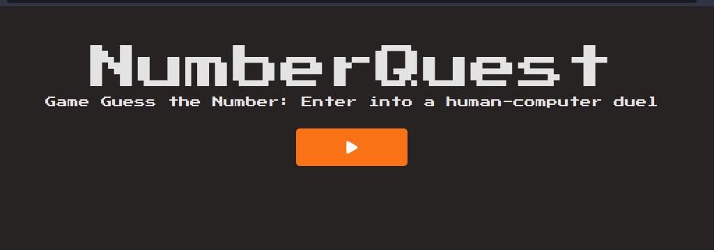
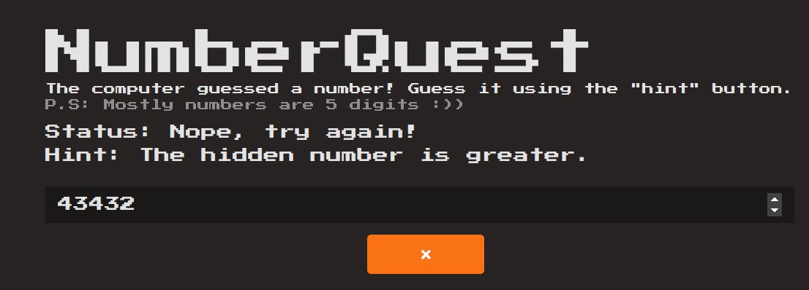
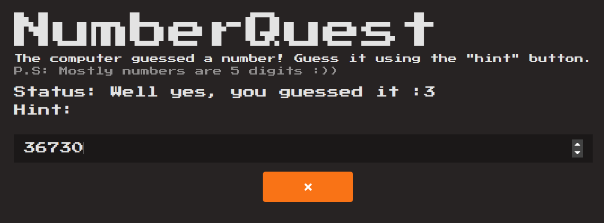

# NumberQuest

NumberQuest is a web-based game built with React, challenging players to guess a randomly generated 5-digit number using hints and real-time feedback. The game incorporates React Icons for stylish iconography.

## Screenshots
</img>
</img>
</img>
</img>

## Features

- **Random Number Generation:** The computer generates a random 5-digit number for players to guess.
- **Real-time Feedback:** Receive instant feedback on your guesses as you type.
- **Hint System:** Get hints to guide you in the right direction.
- **Interactive UI:** Enjoy a responsive and user-friendly interface built with React.
- **Iconography:** Stylish icons provided by React Icons enhance the visual appeal.

## Stack

- **Frontend:** React
  - vite
  - typescript
  - eslint
  - react-router-dom
  - useEffect
  - useState
  - tailwindcss
- **Iconography:** React Icons

## Getting Started

1. Clone the repository.
2. Install dependencies with `npm install`.
3. Run the app with `npm run dev`.

## How to Play

1. Enter your guess in the input field.
2. Receive real-time feedback and hints.
3. Try to guess the correct 5-digit number.

## Usage

- **Guessing:** Input your guesses directly into the provided field.
- **Feedback:** Real-time feedback on your guesses will be displayed.
- **Hints:** Utilize the hint system for additional guidance.
- **Give Up:** If needed, use the "Give Up" button to reveal the correct number.
